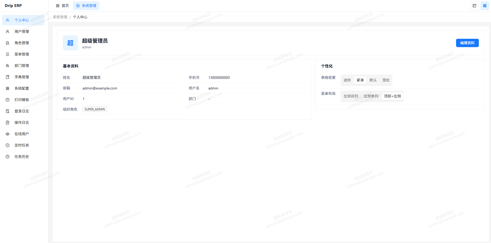
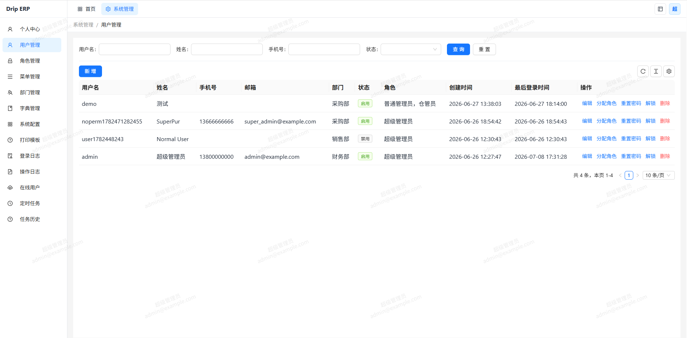
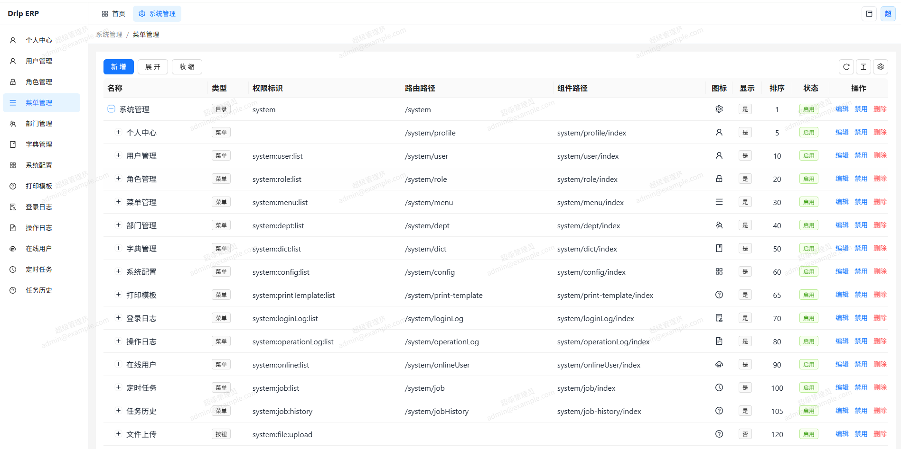
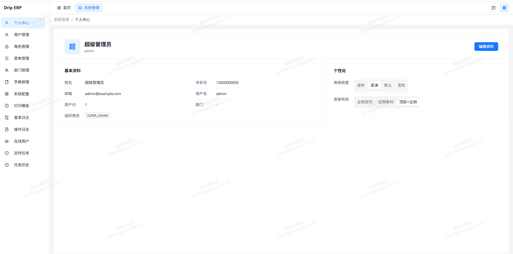
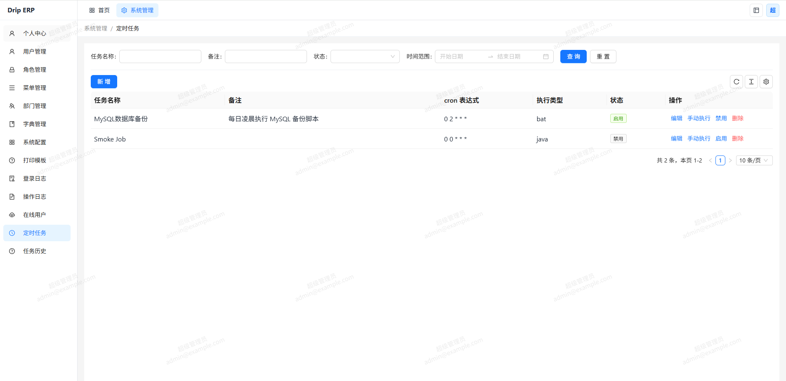
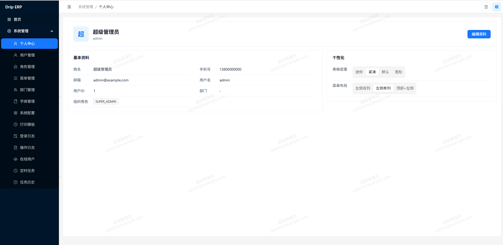
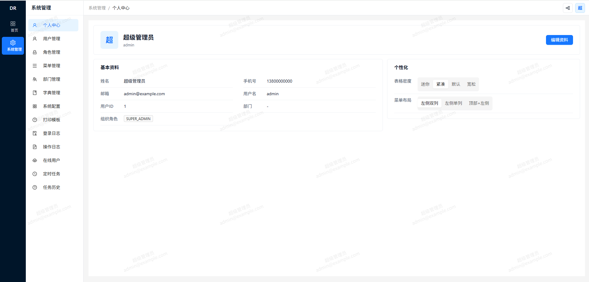
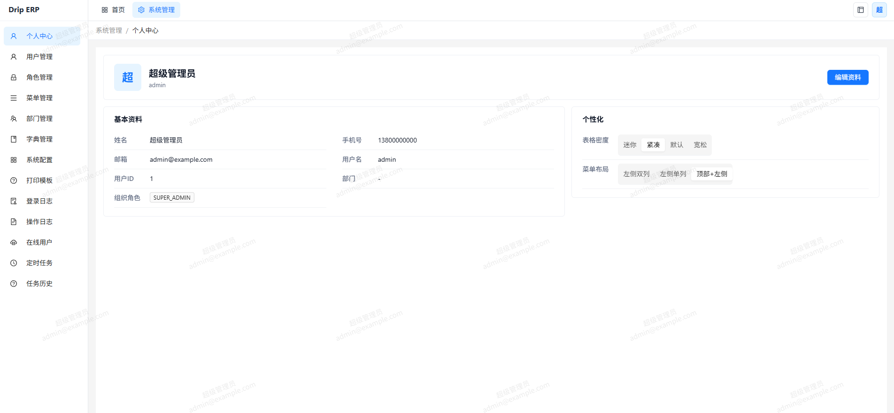

# Drip Admin Vue

Drip Admin Vue 是一个面向开发者的前后端分离管理系统框架。项目将后端 API、前端管理端和移动端目录拆分维护，适合作为企业后台、权限系统、配置中心、定时任务、日志审计、字典管理、打印模板等业务模块的开发基础。

## 技术栈

### 后端

Java 后端：

- Java 25
- Spring Boot 4.1
- Spring Web MVC
- Spring Validation
- Spring JDBC
- Spring Data Redis
- Spring AOP
- MySQL
- MyBatis-Plus 3.5
- Sa-Token 1.45
- SpringDoc OpenAPI 3.0
- Spring Boot Admin 4.0
- EasyExcel 4.0
- Maven

Go 后端：

- Gin
- GORM
- GORM MySQL Driver
- go-redis
- Viper
- zap
- swaggo/gin-swagger
- excelize
- testing
- testify

### 前端

- Vue 3
- TypeScript
- Vite 8
- Ant Design Vue 4
- Pinia
- Vue Router
- Axios
- Sass
- vue-plugin-hiprint
- Vitest
- ESLint
- Prettier
- pnpm

## 项目结构

```text
.
├── backend/    # Java Spring Boot 后端服务
├── backend-go/ # Go 后端服务
├── frontend/   # Vue 管理端
├── mobile/     # 移动端工程目录
├── scripts/    # 脚本目录
├── pic/        # 项目界面截图
└── README.md
```

## 后端说明

Java 后端服务位于 `backend/`，默认接口上下文为 `/api`，默认端口为 `9001`。开发环境配置位于 `backend/src/main/resources/application-dev.yml`，默认连接本地 MySQL 和 Redis。

常用命令：

```bash
cd backend
mvn spring-boot:run
```

Go 后端服务位于 `backend-go/`，实现与 Java 后端一致的 API 路径、响应结构、权限码和 Long 字符串序列化。

常用命令：

```bash
cd backend-go
go run ./cmd/server
go test ./...
```

数据库 SQL 由根目录 `scripts/db` 维护，不随 Java 后端资源打包。当前只保留一份完整初始化脚本：

```text
scripts/db/schema.sql
```

导出当前本地库为基线 SQL：

```bash
python scripts/db/manage_database.py export-baseline
```

手工应用 SQL 文件：

```bash
python scripts/db/manage_database.py apply scripts/db/schema.sql
```

## 前端说明

前端管理端位于 `frontend/`，使用 Vite 启动。开发环境中，`/api` 请求会代理到 `http://localhost:9001`。

常用命令：

```bash
cd frontend
pnpm install
pnpm dev
```

构建与检查：

```bash
pnpm build
pnpm lint
pnpm test
```

## 功能模块

- 登录认证与会话管理
- 用户、角色、菜单与权限管理
- 系统配置与字典管理
- 操作日志、登录日志、在线用户
- 定时任务与任务执行日志
- Excel 导出能力
- 打印模板管理
- Swagger/OpenAPI 接口文档
- Spring Boot Admin 监控接入

## 界面预览

















## 开发约定

- 后端 API 统一挂载在 `/api` 下。
- 前端通过 Vite 代理访问后端服务。
- 后端分页查询使用公共分页 DTO。
- 数据库基线脚本由根目录 `scripts/db/schema.sql` 维护，后端不内置建表或迁移脚本。
- 新业务模块按 controller、dto、entity、mapper、service 分层组织。
